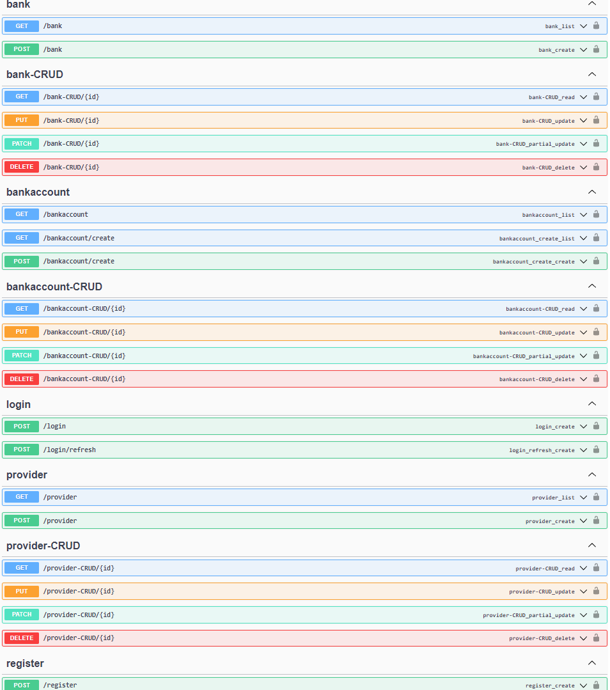

# Katapultcommerce API Challenge

## Introduction

+ It is recommended to have installed on your computer [Python 3.10.1](https://www.python.org/downloads/release/python-3101/)
+ The postgresql database was used [Postgresql](https://www.postgresql.org/download/).
+ The API was created with the framework [Django](https://pypi.org/project/Django/).
+ The library that was imported to do the tests is rest_framework.test from Django REST Framework.    

## Prerequisites

+ Install [Python 3.10.1](https://www.python.org/downloads/release/python-3101/).
+ Install [Postgresql](https://www.postgresql.org/download/).

Enable python virtual environment and then install project dependencies.

```commandline
Create virtual environment:
python -m venv venv
.\venv\Scripts\activate

Install dependencies:
python -m pip install -r requirements.txt

Migrate DB:
python manage.py makemigrations
python manage.py migrate

Run server:
python manage.py runserver

Test:
python manage.py test

API documentation:
[Documentation Swagger](http://127.0.0.1:8000/api/doc/)
[Documentation Redoc](http://127.0.0.1:8000/api/redoc/)

```

# Katapultcommerce Rest API Overview

All requests to the Rest API need a Bearer authorization token in their header.

```commandline
Authorization: Bearer <token>
```

## Endpoints

+ The endpoints to consume the services are:
```commandline
GET http://localhost:8000/api/bank
```
```commandline
POST http://localhost:8000/api/bank
```
```commandline
GET http://localhost:8000/api/bank-CRUD/{id}
```
```commandline
PUT http://localhost:8000/api/bank-CRUD/{id}
```
```commandline
PATCH http://localhost:8000/api/bank-CRUD/{id}
```
```commandline
DELETE http://localhost:8000/api/bank-CRUD/{id}
```
```commandline
GET http://localhost:8000/api/provider
```
```commandline
POST http://localhost:8000/api/provider
```
```commandline
GET http://localhost:8000/api/provider-CRUD/{id}
```
```commandline
PUT http://localhost:8000/api/provider-CRUD/{id}
```
```commandline
PATCH http://localhost:8000/api/provider-CRUD/{id}
```
```commandline
DELETE http://localhost:8000/api/provider-CRUD/{id}
```
```commandline
GET http://localhost:8000/api/bankaccount
```
```commandline
GET http://localhost:8000/api/bankaccount/create
```
```commandline
POST http://localhost:8000/api/bankaccount/create
```
```commandline
GET http://localhost:8000/api/bankaccount-CRUD/{id}
```
```commandline
PUT http://localhost:8000/api/bankaccount-CRUD/{id}
```
```commandline
PATCH http://localhost:8000/api/bankaccount-CRUD/{id}
```
```commandline
DELETE http://localhost:8000/api/bankaccount-CRUD/{id}
```
```commandline
POST http://localhost:8000/api/register
```
```commandline
POST http://localhost:8000/api/login
```
```commandline
POST http://localhost:8000/api/login/refresh
```



## Entity relationship diagram

